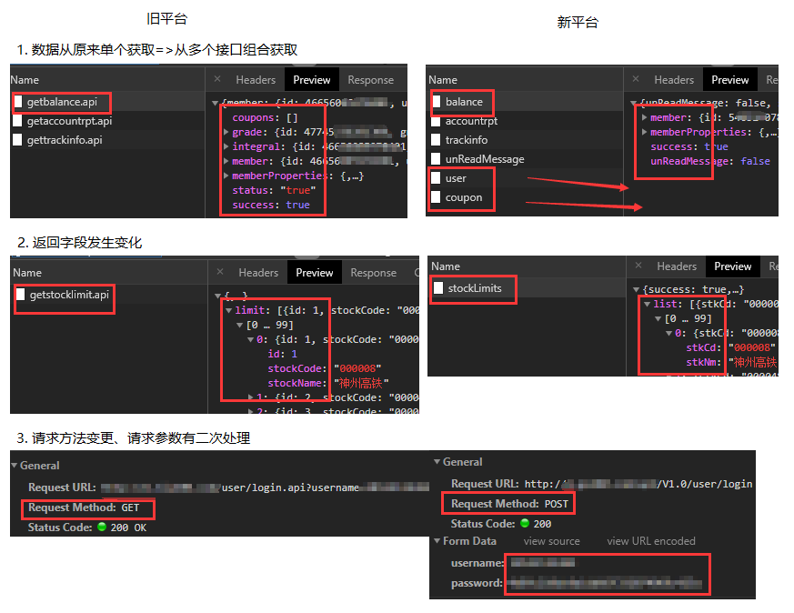

# together

通过 Node 中间服务做接口的适配，解决如下问题：

-   不改动客户端，或者其他开发任务，避免 App 的发版风险
-   完成新老后端系统在 API 的过渡
-   此系统交付 java 团队，让他们在最少 Node 知识体系下完成对业务的开发

ps：此项目是个 Demo 示例，更多 feature 将在此尝试

**带来的一点点收获**

-   相对之前 Koa 项目，重构 **app.js**，更简化明了。虽然只是目录的结构，但更理解**koa 装饰器**的概念。
-   使用 **axios** 在 node 端做 Http 请求，代替 request 模块。和 vue 请求技术方式保持一致。
-   使用 **formidable** 实现了文件的代理上传
-   封装 transfer 转化器，初步让后端 javaer 在最少 Node 知识体系下完成对业务的开发

## 简单的架构图


## 解决场景

-   请求参数的设置
-   响应参数的处理计算
-   多接口的合并



## Demo 示例

1.  一般配置

    通配方式，接入所有请求。并且按照已定 action 规则，做 **transfer** 转换。

    若未设置 action ，则会直接保留原始请求信息转给新平台。

    ```js
    // together\server\router\common.js
    router.all("*", async (ctx, next) => {
    	let respData = await new Transfer({
    		ctx
    	}).run();
    	ctx.body = respData;
    });
    ```

2.  request 请求参数处理

    > 以下将解释 action 规则的配置

    -   接口变更
    -   请求方法替换
    -   请求参数的自定义处理

    比如：老平台请求参数为：

    ```js
    {
        url:'/old/api'
        method:'get',
        data:{
    	    name: "abc",
    	    password: 123456
        }
    }
    ```

    新品台变更为：

    ```js
    {
        url:'/new/api'
        method:'post',
        data:{
    	    username: "abc",
    	    password: md5(123456)
        }
    }
    ```

    action 规则如下：

    ```js
    {
        '/old/api':{
            name: 'api name',
            requestOptions: {
                method: 'post',
                url: '/new/api',
                data: {
                    username: 'name',
                    password: function(){
                        md5(this._getData('password'));
                    }
                }
            }
        }
    }

    ```

3.  response 响应处理

    老接口有 isBindCard 字段代表是否绑定过银行卡，新品台缺失该字段：

    ```js
    {
        '/old/api':{
            name: 'api name',
            requestOptions: {
                method: '...',
                url: '/new/api',
                data: {
                    ...
                }
            },
            responseMapper(data) {
                // 由更为熟悉业务逻辑的后端人员做进一步处理
                data.isBindCard = data.banks && data.banks.length > 0 || false
                return data;
            }
        }
    }

    ```

4.  merge 接口合并

    老平台可能单个接口可以获取所有相关信息，新品台需要多个接口获取：

    ```js
    {
        '/old/api':{
            name: 'api name',
            requestOptions: [{
                method: '...',
                url: '/new/api/1',
                data: {}
            },{
                method: '...',
                url: '/new/api/2',
                data: {}
            },{
                method: '...',
                url: '/new/api/3',
                data: {}
            }],
            responseMapper(data) {
                ...
                return data;
            }
        }
    }
    ```

5.  特殊请求

    以上规则无法适用的情况，比如一个文件上传的例子：

    ```js
    router.post("/upload", async (ctx, next) => {
    	let formData = new FormData();
    	formData.append("picFile", util.getTempFileStream(ctx.state.tempUploadDir));

    	let respData = await new Http({
    		ctx
    	}).request({
    		url: ctx.path,
    		method: ctx.method,
    		data: formData,
    		headers: {
    			"Content-Type": `multipart/form-data; boundary=${formData._boundary}`
    		}
    	});
    	ctx.body = respData;
    });
    ```

## 遇到的问题

本以为很顺利的转换中间件，但为满足变化的需求做了很多 **hardcode** ，也让没有前端经验的同学使用增加了困难。

-   只支持 ajax 传输模式，实际还需要 **表单提交（form submit）** 等
-   缺少 **RESTFUL API** 的解析、参数获取，同时也需要输出成 RESTFUL API
-   实际使用需要定制 API **调用顺序**
-   太多 hardcode 使得 transfer 脱离对象设计，**过程式编程** 的惯性思维让项目难以维护
-   responseMapper 计算太过繁琐，容易出错

# V2

目标：改进项目，减少甚至屏蔽到上面的问题，增加程序扩展性。将在如下方向做努力：

## egg

学习 egg ，并将其最佳实践运用到项目（工程化，封装 koa，面向对象的合理使用）

当然理解 egg 内部实现过程会比较漫长

## GraphQL

对于之前 [蚂蚁金服-BFF 实践](https://os.alipayobjects.com/rmsportal/WtUmBLJSmqtDHkvJzuzM.pdf) API 层的架构思想，个人觉得 GraphQL 有使用的场景，有如下几点好处：

-   适应不同终端
-   可定制化数据
-   数据对象映射
-   “新”的接入层

## 持久层

添加 redis，mysql 等数据库持久层实现

未完待续
